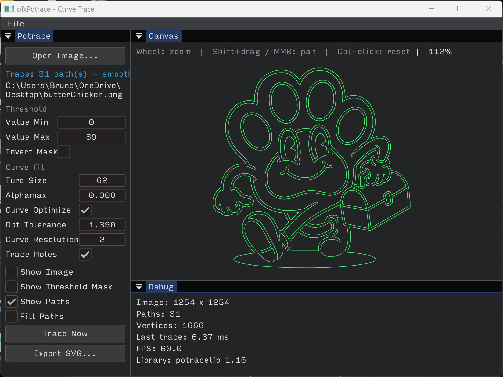

# ofxPotrace

openFrameworks addon for bitmap-to-vector tracing.



## License

**GPL v2+** — see [LICENSE](LICENSE). This addon **always links** vendored [libpotrace](https://potrace.sourceforge.net/) (Peter Selinger, GPL). Binaries that use this addon must comply with the GPL.

## Components

| API | Engine | Use |
|-----|--------|-----|
| **CurveTrace** | libpotrace (Bézier → polylines) | Plot finder **Potrace** in ofxPlotFinders, `example-regionFinder` demo |
| **RegionFinder** | OpenCV HSV/Lab | Color-band mask + polygon contours (separate API) |

## Vendoring libpotrace

Sources live in `libs/potrace/`. To refresh from upstream:

```bash
./scripts/sync-vendor-from-submodule.sh
# or: python scripts/vendor_potrace.py
```
